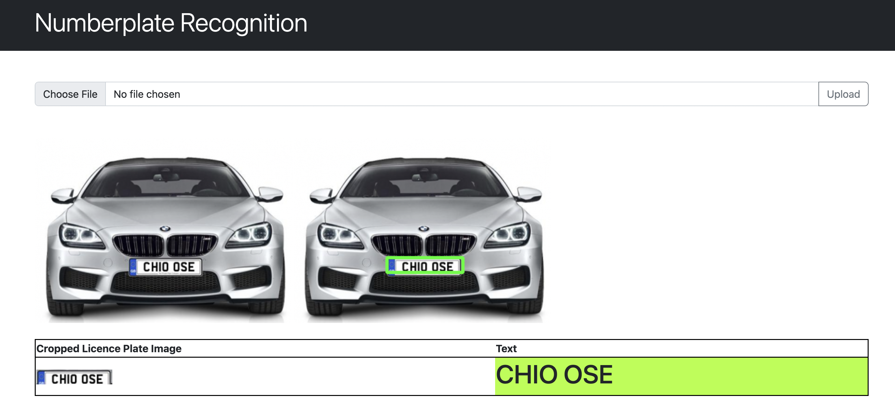

# ANPR-TF
Automatic License Plate Recognition

## Table of contents
* [General info](#general-info)
* [Technologies](#technologies)
* [Setup](#setup)

## General info
This project is a Automatic License Plate Recognition app that has built using Python, PyTorch, Tensorflow, OpenCV and Flask. 

The project structure includes a data preprocessing pipeline to process the input data, find the object of license plate and read the text from the detected license plate.

## Technologies
Project is created with:
* Flask==2.1.3
* keras==2.9.0
* matplotlib 
* matplotlib-inline
* numpy 
* opencv-python==4.6.0.66
* pandas==1.4.3
* pytesseract==0.3.9
* scikit-learn==1.1.1
* tensorboard==2.9.1
* tensorboard-data-server==0.6.1
* tensorboard-plugin-wit==1.8.1
* tensorflow-estimator==2.9.0
* tensorflow-metal==0.5.0
* tesseract==0.1.3

## Setup
To run this project, install it locally pip:

$ pip install -r requirements.txt

## How it looks

## Data

$ BibTeX
$ @misc{make ml,
$ title={Car License Plates Dataset},
$ url={https://makeml.app/datasets/cars-license-plates},
$ journal={Make ML}}

